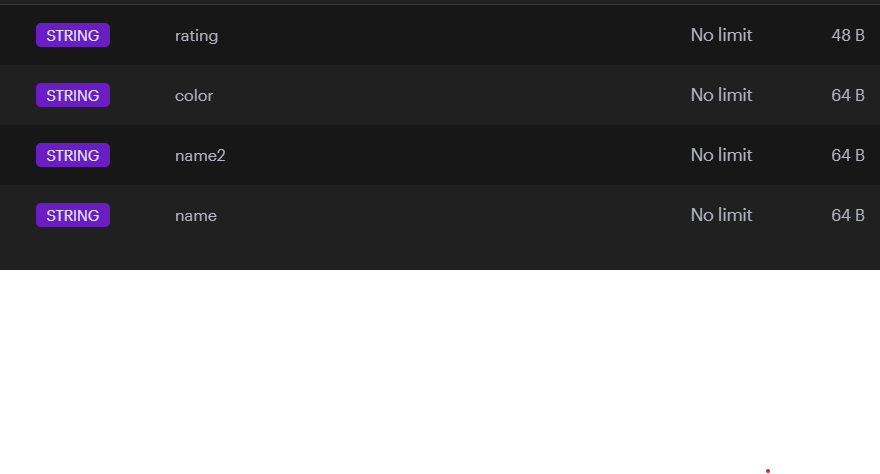
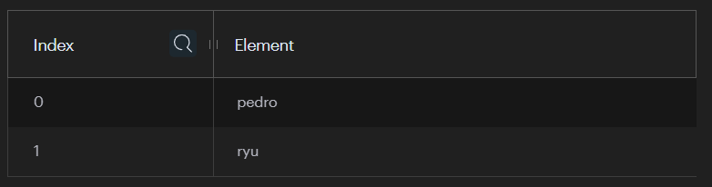
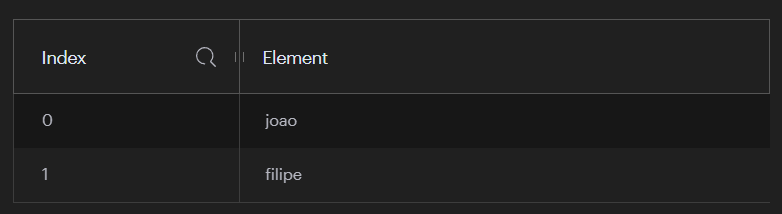
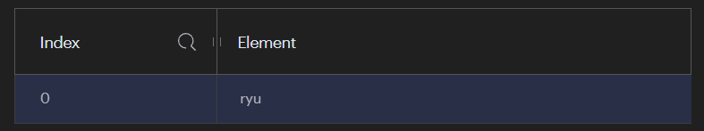
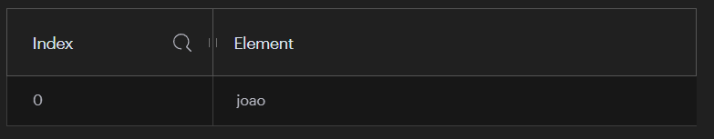

# Redis

#### Importante!
 - Números no Redis são retornados como strings;

## Trabalhando com Strings

Lista de comandos (https://redis.io/docs/latest/commands/?alpha=g)

##### SET

Para criar um nova chave, usamos o SET (o valor eu posso adicionar ou não as "", mas com espaço entre os nomes, deve colocar as ""):

```SET name mario rodrigues```

##### GET

Para retornar uma chave, usamos o GET

```GET name```

##### DEL

Para deleter uma chave, usamos DEL

```DEL name```

##### MSET

Para adicionar multiplos valores, usamos o MSET

```MSET name2 pedro color green rating 10```



##### MGET

Para retornar multilos valores, usamos o MGET

```MGET name2 color```

##### GETRANGE

Para retornar caracteres dos valores, usamos o GETRANGE:

GETRANGE chave inicio fim

```GETRANGE name 0 3```

 - Obs: Para ao contrário, basta usarmos valores negativos: -1 -3

##### SETRANGE

Podemos adicionar um valor em alguma posição, sobreescrendo os caracteres anteriores, se houver.

SETRANGE chave posição valor

```SETRANGE name 2 abc```

##### INCR

Para aumentar um número, mas o valor tem que ser um numero

```INCR rating```

##### INCRBY

Para aumentar mais que 1, usamos o INCRBY

```INCRBY rating 10```

#### DECR

Para diminuir um número, mas o valor tem que ser um numero

```DECR rating```

##### DECRBY

Para diminuir mais que 1, usamos o DECRBY

```DECRBY rating 10```


##### Options

São como flags extras, que possamos passar para mudar um pouco do comportamento

Lista dos options (https://redis.io/docs/latest/commands/set/)

EX:
```SET name yoshi EX 7```
- Assim expira em 7 segundos.


### SETS

Uma coleção únicas de strings. Ou seja, valores repetidos não são permitidos.

- SADD: Para adicionar, usamos SADD:

```SADD names mario peach yoshi```
```SADD moreNames joao pedro filipe```

- SREM: Para remover, usamos SREM:

```SREM names mario```

- SUNION: Para unir SETS, usamos o SUNION (não altera os dados originais, apenas trás ambos unidos, como um get):

```SUNION names moreNames```

- SISMEMBER: Para verificiar se um valor existe dentro do SET, usamos o SISMEMBER:

```SISMEMBER moreNames pedro```

  OBS.: Retorna 0 ou 1


### LISTS

Semelhante ao SETS, porém possui algumas diferenças, como poder armazenar valores repetidos e ter indexes.

- LPUSH: Adicionar um valor a esquerda, ou seja, antes do primeiro

```LPUSH orders ryu```
```LPUSH orders pedro```



- RPUSH: Adicionar um valor a direita, ou seja, depois do primeiro

```RPUSH orders2 joao```
```RPUSH orders2 filipe```



- LPOP: Remove um valor a esquerda, ou seja, a partir do primeiro, então começa pelo index 0

```LPOP orders 1```



- RPOP: Remove um valor a direita, ou seja, a partir do último

```RPOP orders2 1```



- LLEN: Retorna o length da lista

```LLEN orders2```

- LRANGE: Retorna um range de elementos da lista

```LRANGE orders2 0 1```

- LINDEX: Retorna o item do index determinado

```LINDEX orders 1```

- LPOS: Trás a posição do item no index

```LPOS orders ryu```

### HASHES

- É basicamento um objeto, porém todos os valores devem ser strings, porém não pode ter nest properties 

- HSET: Adicionar um hash para um item

```HSET books:1 title "Name of the Wind"```

OBS.: Para sobreescrever, basta enviar o mesmo comando com valor diferente.

- HGET: Retorna um hash de um item

```HGET books:1 title```

- HGETALL: Retorna todos os itens do hash, valores e nomes dos itens

```HGETALL books:1```

- HEXISTS: Verifica se o item existe no hash

```HEXISTS books:1 title```

  OBS.: Retorna 0 ou 1

- HKEYS: Retorna todas as chaves do hash

```HKEYS books:1```

- HVALS: Retorna todos os valores do hash

```HVALS books:1```

- HDEL: Apaga algum item do hash

```HDEL books:1 title```

- DEL: apaga todo o hash

```DEL books:1```